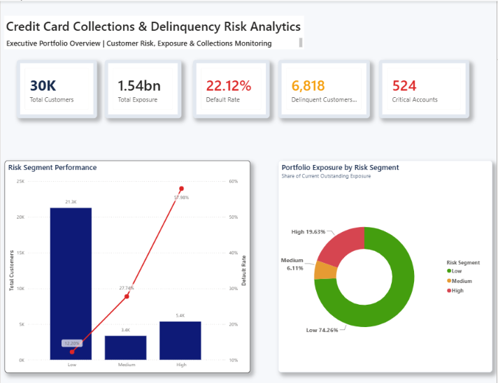
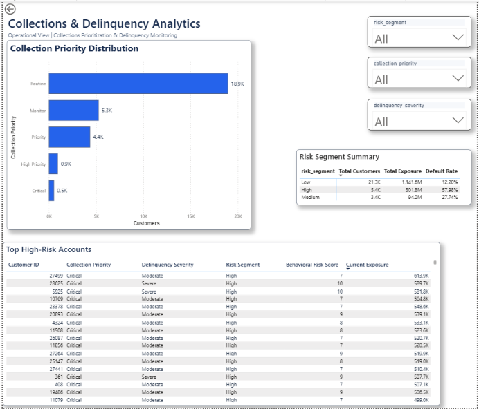
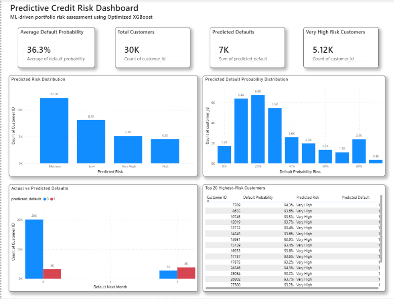
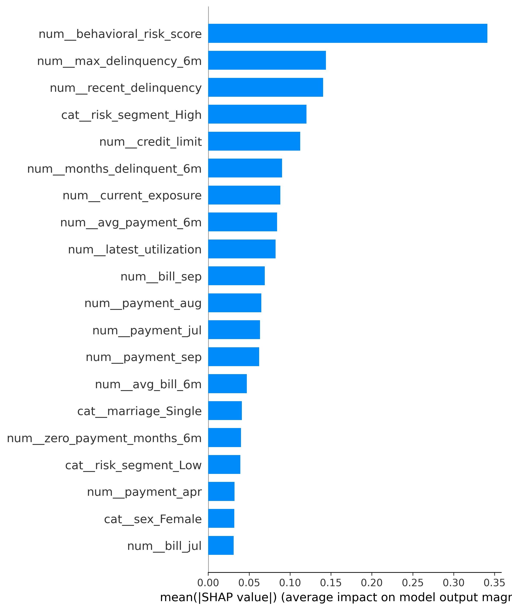
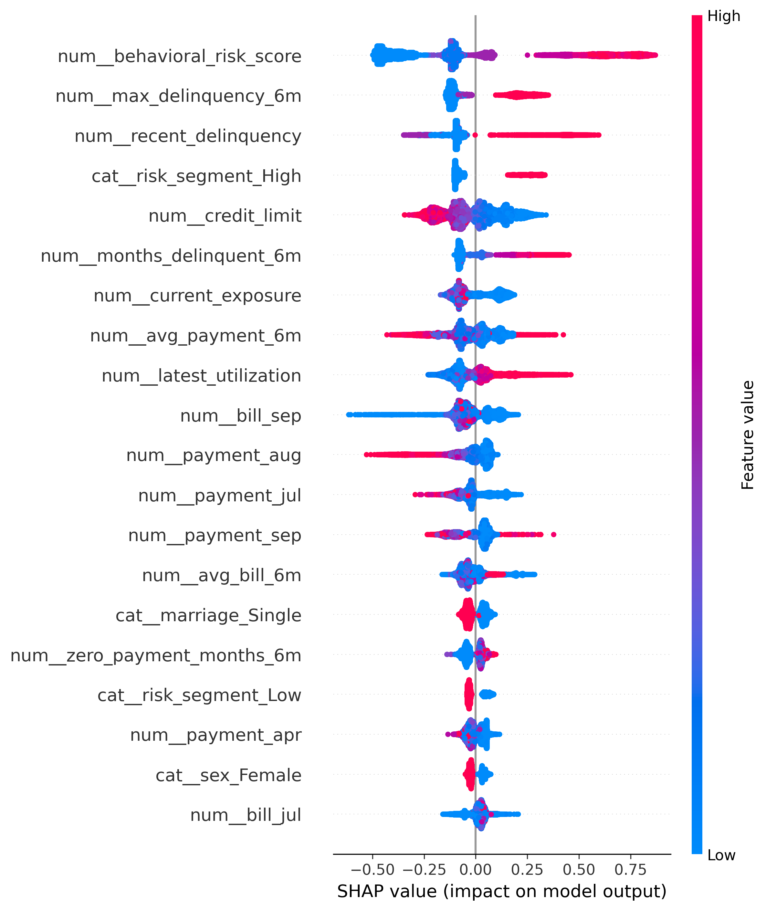
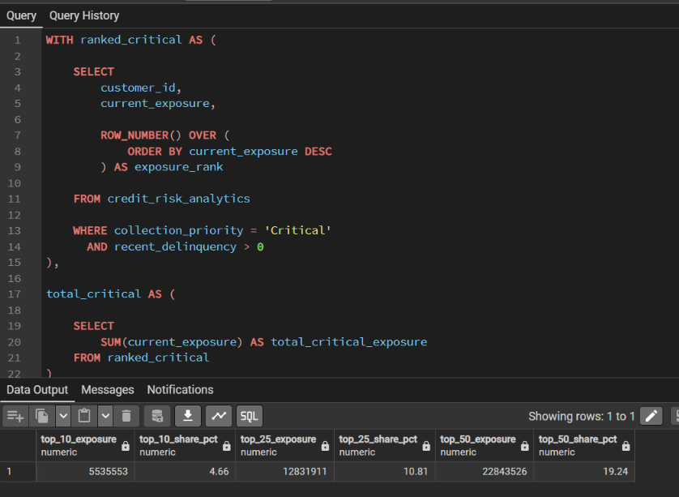

# Credit Risk Analytics & Predictive Modeling

An end-to-end **Credit Risk Analytics and Predictive Modeling** project combining **Python, SQL, PostgreSQL, Power BI, XGBoost, and SHAP** to analyze customer credit behavior, identify delinquency patterns, predict next-month default risk, and prioritize collection efforts.

The project covers the complete analytics lifecycle — from raw credit-card data and business-focused feature engineering to SQL analysis, machine learning model comparison, hyperparameter optimization, model explainability, and predictive Power BI dashboards.

---

## Project Overview

Financial institutions need to continuously monitor customer credit behavior, identify customers at risk of default, and prioritize collection efforts based on both **risk and financial exposure**.

This project simulates a real-world credit-risk workflow by:

- Understanding and cleaning raw credit-card data
- Performing exploratory data analysis
- Engineering behavioral and financial risk features
- Performing business analysis using PostgreSQL and SQL
- Building interactive Power BI dashboards
- Training and comparing multiple classification models
- Optimizing XGBoost using hyperparameter search
- Generating customer-level default probabilities
- Explaining model predictions using SHAP
- Integrating ML predictions into a predictive credit-risk dashboard

---

## Project Architecture

```text
                    Raw Credit Card Dataset
                              │
                              ▼
                 Data Understanding & Cleaning
                              │
                              ▼
                    Feature Engineering
                              │
                 ┌────────────┴────────────┐
                 │                         │
                 ▼                         ▼
           SQL Business Analysis      ML Modeling
                 │                         │
                 ▼                         ▼
            PostgreSQL              Model Comparison
                 │                         │
                 │                         ▼
                 │                  Hyperparameter
                 │                     Tuning
                 │                         │
                 │                         ▼
                 │                  Optimized XGBoost
                 │                         │
                 │                         ▼
                 │                  SHAP Explainability
                 │                         │
                 └────────────┬────────────┘
                              ▼
                    Power BI Dashboards
                              │
                              ▼
                 Predictive Risk Insights
```

---

# Tech Stack

| Category | Technologies |
|---|---|
| Programming | Python |
| Data Processing | Pandas, NumPy |
| Machine Learning | Scikit-learn, XGBoost |
| Explainability | SHAP |
| Database | PostgreSQL |
| Query Language | SQL |
| Visualization | Power BI, Matplotlib, Seaborn |
| Model Persistence | Joblib |
| Development | Jupyter Notebook, Git |

---

# Project Structure

```text
Credit-Delinquency-Analytics/
│
├── data/
│   ├── processed/
│   │   ├── credit_risk_analytics.csv
│   │   └── credit_risk_ml_dataset.csv
│   │
│   └── raw/
│       └── credit_risk_raw_data.xls
│
├── models/
│   ├── best_credit_risk_pipeline.pkl
│   ├── best_xgboost.pkl
│   ├── feature_info.pkl
│   └── preprocessor.pkl
│
├── notebooks/
│   ├── 01_data_understanding.ipynb
│   ├── 02_Feature_Engineering.ipynb
│   ├── 03_Exploratory_Data_Analysis.ipynb
│   ├── 04_Model_Training.ipynb
│   ├── 05_Model_Comparison.ipynb
│   └── 06_Model_Explainability.ipynb
│
├── powerbi/
│   └── Credit_Risk_Analytics.pbix
│
├── predictions/
│   ├── default_predictions.csv
│   └── portfolio_risk_predictions.csv
│
├── results/
│   ├── feature_importance.csv
│   ├── model_explainability_summary.csv
│   ├── model_metadata.csv
│   ├── model_metrics.csv
│   ├── shap_feature_importance.csv
│   └── training_configuration.csv
│
├── Screenshots/
│   ├── executive_dashboard.png
│   ├── operations_dashboard.png
│   ├── predictive_credit_risk.png
│   ├── sql_analysis.png
│   ├── shap_bar.png
│   └── shap_summary.png
│
├── sql/
│   ├── 01_portfolio_overview.sql
│   ├── 02_delinquency_analysis.sql
│   ├── 03_collection_priority.sql
│   └── 04_collection_work_queue.sql
│
├── LICENSE
├── README.md
└── requirements.txt
```

---

# Dataset

The project uses a publicly available credit-card default dataset containing approximately **30,000 customer records** with demographic information, credit limits, monthly billing amounts, payment amounts, and repayment-status information.

The raw dataset contains six months of billing, payment, and repayment behavior.

### Main data categories

- Customer demographics
- Credit limit
- Monthly bill amounts
- Monthly payment amounts
- Monthly repayment status
- Next-month default indicator

The raw data is transformed into separate analytical and machine-learning datasets through the Python feature-engineering workflow.

---

# Data Processing & Feature Engineering

The raw credit-card dataset was processed and transformed using Python.

The workflow included:

- Data quality validation
- Duplicate and missing-value checks
- Data type handling
- Exploratory analysis
- Credit utilization analysis
- Six-month payment behavior analysis
- Delinquency analysis
- Behavioral risk scoring
- Customer risk segmentation
- Collection prioritization

## Key Engineered Features

| Feature | Purpose |
|---|---|
| `current_exposure` | Measures current outstanding credit exposure |
| `latest_utilization` | Measures the customer's latest credit utilization |
| `avg_bill_6m` | Average bill amount over six months |
| `avg_payment_6m` | Average payment amount over six months |
| `months_delinquent_6m` | Number of delinquent months in the six-month period |
| `max_delinquency_6m` | Maximum delinquency severity |
| `recent_delinquency` | Captures recent delinquency behavior |
| `behavioral_risk_score` | Combines multiple repayment-risk indicators |
| `delinquency_trajectory` | Identifies improving, stable, or deteriorating behavior |
| `risk_segment` | Groups customers into behavioral risk categories |
| `exposure_band` | Segments customers based on financial exposure |
| `collection_priority` | Supports collection prioritization |
| `recent_delinquency_status` | Provides an interpretable delinquency label |

The resulting machine-learning dataset contains **35 model features** covering customer demographics, credit behavior, payment history, utilization, delinquency, exposure, and collection-related signals.

---

# SQL Business Analysis

Business analysis was performed using **PostgreSQL and SQL**.

The SQL layer translates customer-level data into portfolio and collection insights.

## Analysis Areas & Key Findings

**Portfolio Overview** (`01_portfolio_overview.sql`)
Summarizes total customers, total credit exposure, and overall default rate across the portfolio, then breaks exposure and default rate down by risk segment.
> **Key finding:** The portfolio holds **30,000 customers** with **₹153.7 crore** in total exposure and an overall default rate of **22.12%**. Risk segments are inversely related between count and exposure: the **High-risk segment** is only 17.9% of customers (5,359) but has a **57.98% default rate**, while the **Low-risk segment** makes up 70.9% of customers (21,281) yet holds **74.26% of total portfolio exposure** at just a 12.20% default rate. This means the bulk of the book's dollar risk sits in a small, easily-identifiable high-risk minority rather than being spread evenly.

**Delinquency Analysis** (`02_delinquency_analysis.sql`)
Breaks down default rate by recent delinquency bucket, and measures how much of each risk segment's exposure is currently delinquent.
> **Key finding:** Default rate rises sharply with delinquency depth — from **13.83%** for current accounts to **33.95%** (1 month), **69.14%** (2 months), and **71.92%** (3+ months delinquent), a more than **5x increase** from current to severely delinquent. Delinquency is also heavily concentrated: the High-risk segment has a **94.85% delinquency rate**, and **97.4% of that segment's exposure (₹293.9M of ₹301.8M) is currently delinquent** — versus just 0.14%–2.4% for Medium/Low segments.

**Collection Priority** (`03_collection_priority.sql`)
Ranks customers by collections priority tier, evaluating default rate, exposure, and exposure concentration within the highest-risk tier.
> **Key finding:** The **"Critical"** priority tier is only **524 customers (1.7% of the portfolio)** but carries an average exposure of **₹229,844** per customer — roughly **4.5x the portfolio average (₹51,246)** — with a **58.78% default rate**. Within Critical + delinquent accounts, exposure is itself concentrated: the **top 50 accounts by exposure account for 19.24%** of that tier's total delinquent exposure, meaning a very small, rankable group of customers represents a disproportionate share of at-risk capital.

**Collection Work Queue** (`04_collection_work_queue.sql`)
Generates an actionable, ranked list of highest-priority delinquent accounts (top 10 per priority tier by exposure) plus a running cumulative-exposure view for Critical accounts — the direct output a collections team would work from day to day.

## SQL Techniques Used

- Common Table Expressions (CTEs)
- Aggregate functions
- `CASE` statements
- Window functions
- Ranking
- Conditional filtering
- Business-rule based segmentation

The SQL scripts are organized in the `sql/` directory.

---

# Power BI Dashboard

The project contains three Power BI views covering **executive reporting, operational collections analysis, and predictive credit risk**.

---

## 1. Executive Dashboard

Provides a high-level overview of portfolio health and customer risk.

### Key Metrics

- Total Customers
- Total Credit Exposure
- Default Rate
- Delinquent Customers
- Critical Accounts
- Risk Segment Performance
- Portfolio Exposure Distribution

### Dashboard Preview



---

## 2. Collections & Delinquency Dashboard

Designed from an operational perspective to help identify customers requiring collection attention.

### Key Analysis

- Collection Priority Distribution
- Risk Segment Summary
- Delinquency Analysis
- High-Risk Customer Identification
- Customer-Level Analysis
- Interactive Filtering

### Dashboard Preview



---

## 3. Predictive Credit Risk Dashboard

Machine-learning predictions were integrated into Power BI to provide a forward-looking view of portfolio risk.

### Key Metrics

- Average Default Probability
- Total Customers
- Predicted Defaults
- Very High Risk Customers

### Key Visuals

- Predicted Risk Distribution
- Default Probability Distribution
- Top 20 Highest-Risk Customers
- Actual vs Predicted Defaults

The dashboard extends the analysis from:

> **What happened?**

to:

> **Which customers are most likely to default next?**

### Dashboard Preview



---

# Machine Learning

A supervised machine-learning pipeline was developed to predict whether a customer is likely to default in the following month.

## Target Variable

```text
default_next_month
```

The model uses customer demographic, credit utilization, billing, payment, and six-month delinquency features.

---

## Models Evaluated

The following classification models were compared:

- Logistic Regression
- Random Forest
- XGBoost
- Tuned Random Forest
- Optimized XGBoost

Models were evaluated using:

- Accuracy
- Precision
- Recall
- F1-Score
- ROC-AUC

---

## Model Performance

| Model | Accuracy | Precision | Recall | F1-Score | ROC-AUC |
|---|---:|---:|---:|---:|---:|
| Logistic Regression | 75.08% | 45.29% | 60.81% | 51.91% | 76.65% |
| Random Forest | 78.48% | 51.19% | 58.33% | 54.53% | 77.81% |
| XGBoost | **81.85%** | **66.08%** | 36.85% | 47.31% | 77.68% |
| Tuned Random Forest | 78.08% | 50.39% | 58.33% | 54.07% | 77.83% |
| Optimized XGBoost | 79.00% | 52.36% | **56.07%** | 54.15% | **78.17%** |

---

## Model Selection

The final model selected for the predictive risk workflow was **Optimized XGBoost**.

Although the baseline XGBoost model achieved the highest accuracy at **81.85%**, its recall for the default class was only **36.85%**.

For a credit-risk application, failing to identify a potential defaulter can be more costly than generating additional false positives. The optimized XGBoost model improved default recall to **56.07%** while achieving the highest ROC-AUC of **78.17%** among the evaluated models.

Therefore, model selection considered the broader **risk-detection trade-off rather than accuracy alone**.

---

# Hyperparameter Optimization

Tree-based models were further optimized using **RandomizedSearchCV**.

Hyperparameter tuning was performed for:

- Random Forest
- XGBoost

The optimization process explored model parameters such as:

- Number of estimators
- Learning rate
- Maximum tree depth
- Minimum child weight
- Subsampling
- Column sampling
- Regularization

The optimized models were evaluated on the held-out test set.

---

# Model Explainability

To understand the factors influencing model predictions, the project uses **SHAP (SHapley Additive exPlanations)**.

SHAP analysis provides insight into how individual features contribute to model predictions.

## Explainability Analysis Includes

- Global feature importance
- SHAP feature importance
- SHAP summary plot
- Feature-level contribution analysis
- Model explainability outputs

The analysis helps answer:

> **Why does the model consider a customer high risk?**

rather than treating the model as a black box.

### SHAP Feature Importance



### SHAP Summary



---

# Predictive Risk Outputs

The trained model generates customer-level predictions containing:

```text
Customer ID
Default Probability
Predicted Default
Predicted Risk
```

Customers are categorized into four predictive risk groups:

```text
Low
Medium
High
Very High
```

These predictions are stored in:

```text
predictions/
├── default_predictions.csv
└── portfolio_risk_predictions.csv
```

The portfolio predictions are also used to identify and rank the highest-risk customers in the Power BI dashboard.

---

# Modeling Considerations & Limitations

The dataset is a publicly available credit-card default dataset, so the modeling results should be treated as a **portfolio-project benchmark rather than production credit-risk performance**.

The classification task is imbalanced, so model evaluation focuses on **Precision, Recall, F1-Score, and ROC-AUC** in addition to Accuracy.

The project uses a stratified train/test evaluation workflow, with cross-validation used during hyperparameter optimization. For a production credit-risk system, an **out-of-time validation strategy** would be preferable to assess performance on future customer cohorts.

The final XGBoost model achieves **56.07% recall** for the default class. This means the current operating threshold still misses a meaningful proportion of actual defaults.

A production implementation would require further probability-threshold analysis based on the business cost of false negatives versus false positives.

Potential next steps would include:

- Probability-threshold optimization
- Precision-recall trade-off analysis
- Out-of-time validation
- Segment-level error analysis
- Probability calibration
- Fairness evaluation across demographic groups
- Monitoring for data and model drift

---

# Model Artifacts

The trained models and supporting artifacts are stored in the `models/` directory.

```text
models/
├── best_credit_risk_pipeline.pkl
├── best_xgboost.pkl
├── feature_info.pkl
└── preprocessor.pkl
```

The main saved pipeline contains the preprocessing and final model required for inference.

Additional model outputs are stored in:

```text
results/
├── feature_importance.csv
├── model_explainability_summary.csv
├── model_metadata.csv
├── model_metrics.csv
├── shap_feature_importance.csv
└── training_configuration.csv
```

---

# Key Business Insights

The analysis highlights several important patterns across the credit portfolio:

- Low-risk customers represent the majority of the customer base.
- Higher behavioral risk is associated with increased default likelihood.
- Persistent or worsening delinquency indicates increased customer risk.
- High credit utilization combined with weak payment behavior can indicate elevated risk.
- A relatively small group of customers can represent significant collection exposure.
- Combining behavioral risk with financial exposure provides a more actionable collection-prioritization framework.
- Predictive default probabilities provide a forward-looking complement to historical SQL and Power BI analysis.
- Model explainability helps identify the behavioral and financial factors contributing to predicted risk.

---

# Business Value

The project demonstrates how financial institutions can combine **descriptive, diagnostic, and predictive analytics** to improve credit-risk monitoring.

The solution can support:

- Portfolio health monitoring
- Early identification of potentially risky customers
- Delinquency tracking
- Collection prioritization
- Customer-level risk assessment
- Data-driven collection strategies
- Executive decision-making
- Predictive portfolio monitoring

---

# SQL Analysis Preview



---

# How to Run

## Clone the Repository

```bash
git clone https://github.com/HarshRaj-072004/Credit-Risk-Analytics-Dashboard.git

cd Credit-Risk-Analytics-Dashboard
```

## Install Dependencies

```bash
pip install -r requirements.txt
```

## Recommended Workflow

### 1. Data Understanding

Run:

```text
notebooks/01_data_understanding.ipynb
```

### 2. Feature Engineering

Run:

```text
notebooks/02_Feature_Engineering.ipynb
```

### 3. Exploratory Data Analysis

Run:

```text
notebooks/03_Exploratory_Data_Analysis.ipynb
```

### 4. Model Training

Run:

```text
notebooks/04_Model_Training.ipynb
```

### 5. Model Comparison

Run:

```text
notebooks/05_Model_Comparison.ipynb
```

### 6. Model Explainability

Run:

```text
notebooks/06_Model_Explainability.ipynb
```

### 7. SQL Analysis

Import the processed dataset into PostgreSQL and execute the SQL scripts located in the `sql/` directory.

### 8. Power BI

Open:

```text
powerbi/Credit_Risk_Analytics.pbix
```

to explore the executive, collections, delinquency, and predictive credit-risk dashboards.

---

# Author

**Harsh Raj**

GitHub: [HarshRaj-072004](https://github.com/HarshRaj-072004?tab=repositories)

LinkedIn: [harsh-raj-3537342a2](https://www.linkedin.com/in/harsh-raj-3537342a2/)


